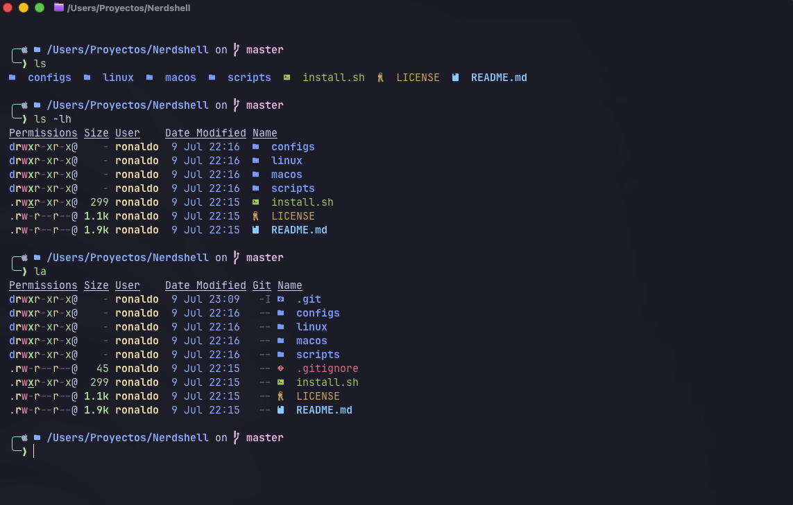
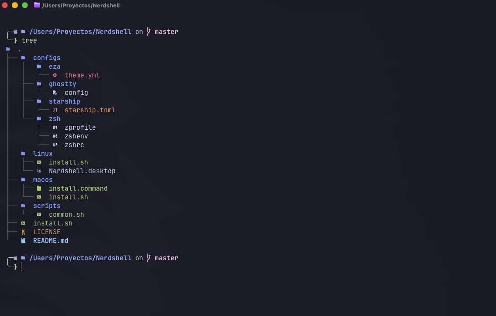
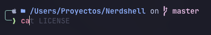
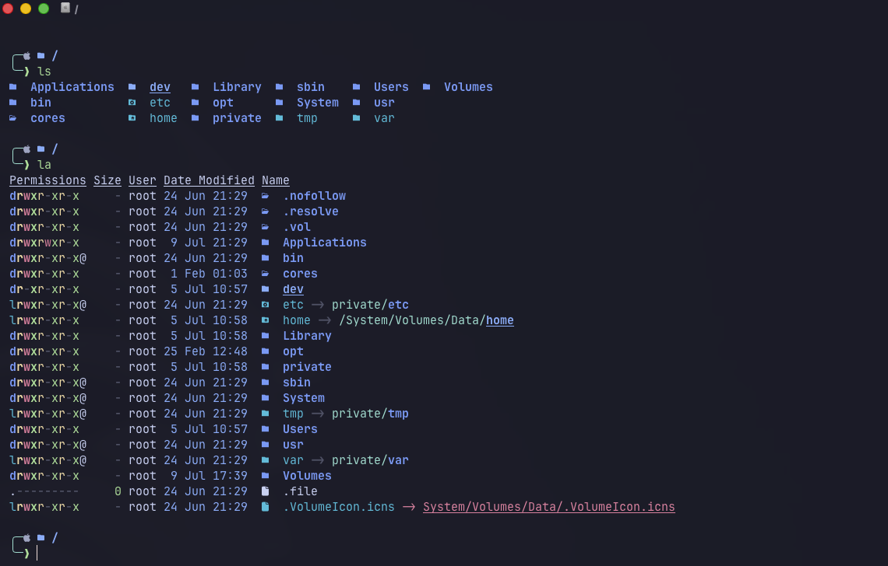

# Nerdshell

Nerdshell is a premium terminal environment for macOS and Linux: Zsh, Starship, eza icons, Ghostty, Git delta, fast search, better navigation, Java/Grails and Node/Angular-friendly defaults.

It is designed for people who want a beautiful, visual, useful terminal without manually wiring every tool.

## Preview

### Project listing



### Tree view



### Autosuggestions and Git branch



### Root directory listing



## macOS: double click install

Build the visual macOS installer:

```bash
./packaging/macos/build-dmg.sh 0.1.0
```

Open `dist/Nerdshell-0.1.0-macOS.dmg`, drag **Nerdshell Installer** to
Applications and open it. Press **Instalar Nerdshell** and follow the progress
in Terminal.

The legacy repository installer remains available by double clicking
`macos/install.command`.

The default build uses an ad-hoc signature for local testing. For public
distribution, provide a Developer ID identity and an optional notarization
profile:

```bash
CODESIGN_IDENTITY="Developer ID Application: Your Name (TEAMID)" \
NOTARY_PROFILE="nerdshell-notary" \
./packaging/macos/build-dmg.sh 0.1.0
```

The installer creates backups before replacing any shell or terminal config.

## Debian, Ubuntu and derivatives (.deb)

Build the package on macOS or Linux:

```bash
./packaging/build-deb.sh 0.1.0
```

The package is created at `dist/nerdshell_0.1.0_all.deb`. Install it with your
graphical package manager (Discover, App Center, Software) or with:

```bash
sudo apt install ./dist/nerdshell_0.1.0_all.deb
```

After installing the package, open **Nerdshell Installer** from the application
menu. It runs as your normal user, creates backups, installs available tools and
applies the terminal configuration.

Official targets are Debian, Ubuntu and Kubuntu. Linux Mint, KDE Neon, Pop!_OS,
Zorin OS and other compatible derivatives are expected to work as well.

## Arch Linux, Omarchy and derivatives

Build the native Arch package from macOS or Linux with Docker running:

```bash
./packaging/arch/build-arch.sh 0.1.0
```

Install the generated package:

```bash
sudo pacman -U ./dist/nerdshell-0.1.0-1-any.pkg.tar.zst
```

Then open **Nerdshell Installer** from the application menu. On Omarchy, it
works with the default Alacritty terminal and JetBrainsMono Nerd Font; Ghostty
remains optional. Nerdshell backs up existing Starship and shell configuration
before applying its own settings and does not modify Hyprland or Omarchy themes.

## Fedora, RHEL, Rocky, AlmaLinux and CentOS Stream

Build the RPM from macOS or Linux with Docker running:

```bash
./packaging/rpm/build-rpm.sh 0.1.0
```

Install it with DNF:

```bash
sudo dnf install ./dist/nerdshell-0.1.0-1.noarch.rpm
```

Then open **Nerdshell Installer** from the application menu. Fedora provides
most optional terminal tools directly. On RHEL-compatible systems, enabling
EPEL makes more tools available, but it is not required for the RPM itself to
install or for the core Nerdshell configuration to work.

## Other Linux distributions

From the project folder:

```bash
./linux/install.sh
```

Some Linux file managers allow double click execution through `linux/Nerdshell.desktop`, but behavior varies by desktop environment. The terminal command above is the reliable path.

## What Nerdshell installs/configures

- Zsh with fast startup, history, completion, autosuggestions and syntax highlighting.
- Starship prompt with visual Java, Node, Git, Gradle and Docker context.
- eza with Nerd Font icons and a rich file theme.
- Bat, ripgrep, fd, fzf, zoxide, btop, fastfetch and lazygit.
- Git delta for side-by-side diffs and line numbers.
- Ghostty config with JetBrainsMono Nerd Font and Symbols Nerd Font.
- SDKMAN and NVM bootstrap for Java/Grails/Groovy and Node workflows.

## Safety

Nerdshell does not delete your existing config. It backs up these files first:

- `~/.zshrc`
- `~/.zprofile`
- `~/.zshenv`
- `~/.config/starship.toml`
- `~/.config/eza/theme.yml`
- `~/.config/ghostty/config`
- `~/.gitconfig`
- `~/.config/lsd`

Backups are saved under:

```text
~/.config-backups/nerdshell-YYYYMMDD-HHMMSS
```

## Notes

- macOS is the most complete install path.
- Linux support covers common package managers: `apt`, `dnf`, `pacman`, and `zypper`.
- Terminal icon rendering depends on the terminal app using a Nerd Font. Ghostty is recommended.
